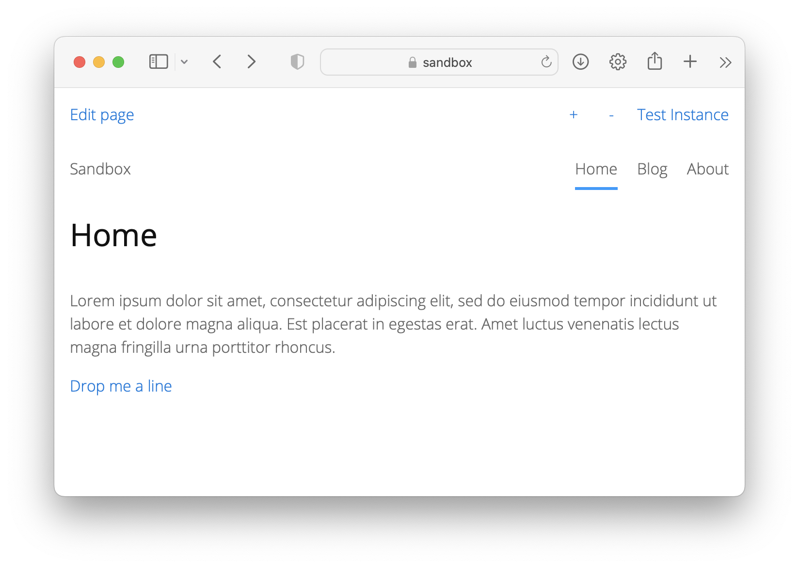

# Maillink 0.8.23

Creates a `mailto:` link without a visible mail address in the source text.

## How to install the extension

[Download ZIP file](https://github.com/pftnhr/yellow-maillink/archive/refs/heads/main.zip) and copy it into your `system/extensions` folder. [Learn more about extensions](https://github.com/annaesvensson/yellow-update).

## How to create a `mailto:` link

Create a `[mailto]` shortcut.

## Examples

`mailto:` link with custom link text

    [mailto "Custom link text"]

with an image shown instead of link text

    [mailto "Custom link text" photo.jpg]

If you insert an image, the link text becomes the `title` and `alt` attribute.

## Settings

The following settings can be configured in file `system/extensions/yellow-system.ini`:

    MailAddress = default e-mail address

If `MailAddress` isn't filled in here, the email of the webmaster (yellow-system.ini, line 5) will be taken.

The following setting can be configured in file `system/extensions/yellow-language.ini`:

    MailLinktext = default link text

## Developer

Robert Pfotenhauer. [Get help](https://datenstrom.se/yellow/help/).
